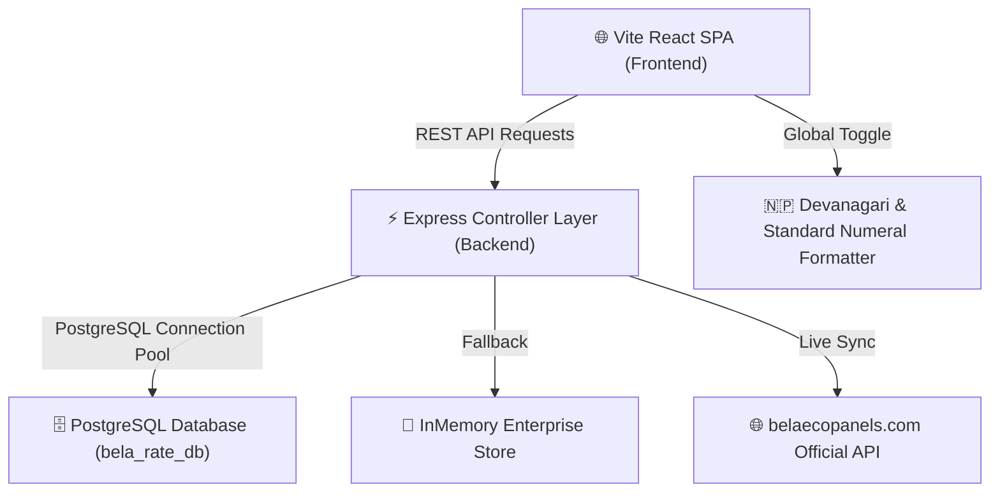

# Bela Rate & Costing Manager - Enterprise Documentation & Architectural Suite

Welcome to the **Bela Rate & Costing Manager** enterprise documentation hub.

---

## 🏗️ 1. High-Level System Architecture & Flowchart

---

## 🗄️ 2. PostgreSQL Enterprise Database Schema (`bela_rate_db`)

### Connection Settings:
- **Host**: `localhost` (or `process.env.PGHOST`)
- **Port**: `5432`
- **Database**: `bela_rate_db`
- **User**: `postgres`
- **Password**: `Postgres123`

### Key Tables:
1. **`categories`**: Persistent category registry (`id`, `name`, `code`, `status`, `vat_rate`, `is_default`, `created_at`).
2. **`column_schemas`**: User-defined custom table column rules (`id`, `table_id`, `key`, `label`, `type`, `access_role`, `visible`, `required`, `description`).
3. **`projects`**: Target group projects registry (`id`, `name`, `customer_name`, `area_sqft`, `building_type`, `status`).
4. **`boqs`**: Comprehensive Bill of Quantity files containing line item pricing and direct/overhead cost calculations.
5. **`rate_versions`**: Append-only historical rate audit lineage log.

---

## 📜 3. Real-World Rate Governance Scenarios

### Scenario 1: Estimator Rate Revision
1. Estimator opens Product Master or Eco Panels rate view and clicks **Request Change** on `EP-075`.
2. Proposes rate revision from `NPR 2,150` to `NPR 2,300/m²` with justification.
3. Request enters **Approval Workflow** pending queue (`PENDING_APPROVAL`).
4. Rate Manager approves request ➔ System locks previous version in audit lineage and activates new rate. Past quotations remain 100% unaffected.

### Scenario 2: Target Group BOQ Creation & Overwrite/Fork
1. Sales engineer builds BOQ for customer target group.
2. User selects **Save Target Group BOQ**:
   - Mode `overwrite`: Overwrites existing target group structure in PostgreSQL `boqs` table.
   - Mode `copy`: Forks a new revision copy with clean timestamped project title.
3. Reloading the target group automatically fetches saved BOQ structure from PostgreSQL DB.

---

## 🛠️ 4. Dynamic Column & Numeral System Features
- **Dynamic Extra Column Selector**: In Product Master, user can check/uncheck optional extra columns (`Specification`, `Brand`, `Size`, `Subcategory`, or custom schema fields). Unchecked by default for a clean basic table view.
- **Icon-Only Header View Toggle**: Table Grid View vs Kanban Cards View toggle switch in header rendered with sleek icons (`TableIcon` / `LayoutGrid`).
- **Icon-Only Delete Button**: Delete action button displays icon-only with accessible tooltip (`Move product to Trash Bin`).
- **Global Digit Mode**: Global toggle switches numbers system-wide between Standard Western Roman (`NPR 1,23,456.00`) and Nepali Devanagari (`रु. १,२३,४५६.००`).
