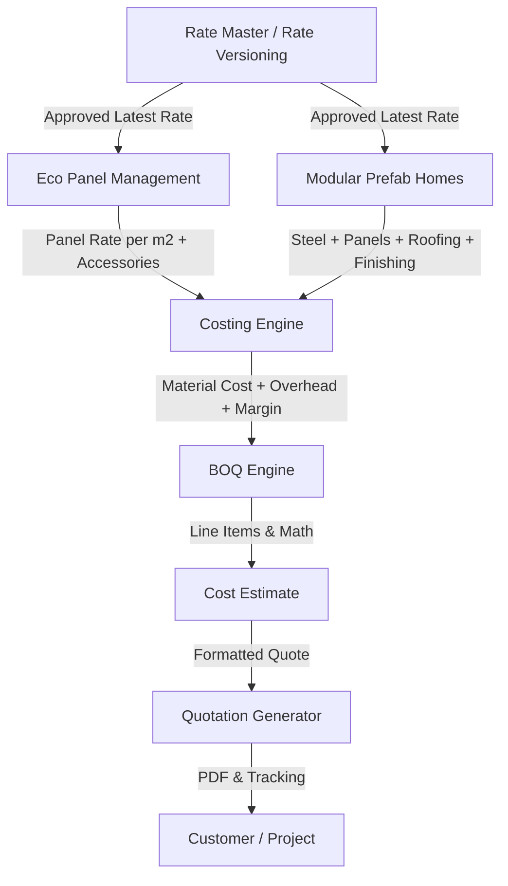

# Visual Training Guide & Costing Flow Diagrams

This document contains visual flowcharts and infographics to train team members on how rates propagate through the Bela Rate & Costing Manager system.

---

## 1. Rate Master Propagation Architecture



---

## 2. Approval Workflow Infographic

```
┌────────────────────────┐
│  Rate Staff / Manager  │
└───────────┬────────────┘
            │ Edits Rate (e.g. Steel Rs.108 -> Rs.112)
            ▼
┌────────────────────────┐
│  Rate Change Request   │ ── Status: PENDING_APPROVAL
└───────────┬────────────┘
            │ Notification sent to Approver
            ▼
┌────────────────────────┐
│   Approver Dashboard   │
├────────────────────────┤
│ Old: Rs. 108           │
│ New: Rs. 112 (+3.7%)   │
│ Reason: Supplier raise │
└─────┬────────────┬─────┘
      │            │
  [Reject]     [Approve]
      │            │
      ▼            ▼
 Status:       Status: ACTIVE
 REJECTED      - Updates Rate Master
               - Updates Future BOQs
               - Archives Previous Version
```

---

## 3. Modular Prefab Home Rate Breakdown Structure

```
                  2 BEDROOM MODULAR HOME COST
                              │
     ┌────────────────────────┼────────────────────────┐
     ▼                        ▼                        ▼
Steel Structure           EPS Panels               Roofing & Shell
  ├─ Columns (kg)           ├─ Exterior Wall (m²)     ├─ Truss Steel (kg)
  ├─ Beams (kg)             ├─ Interior Wall (m²)     ├─ CGI / Roofing Sheet (m²)
  └─ Trusses (kg)           └─ Ceiling Panel (m²)     └─ Insulation
     │                        │                        │
     ├────────────────────────┼────────────────────────┘
     ▼                        ▼
Doors & Windows          Flooring & Finishes
  ├─ Main Door (pcs)        ├─ Cement Board (sq.ft)
  ├─ Interior Doors (pcs)   ├─ Vinyl Flooring (sq.ft)
  └─ UPVC Windows (pcs)     └─ Exterior Paint (ltr)
     │                        │
     ├────────────────────────┼────────────────────────┐
     ▼                        ▼                        ▼
MEP & Fixtures            Labour & Assembly        Freight & Transport
  ├─ Electrical DB/Wires    ├─ Assembly Crew (days)  ├─ Crane / Flatbed Truck
  └─ Plumbing & Sanitary    └─ On-site Supervisor    └─ Site Delivery Fee
```

---

## 4. Cost Breakdown Layer

```
┌─────────────────────────────────────────────────────────────┐
│                       SELLING PRICE                         │
│ ┌─────────────────────────────────────────────────────────┐ │
│ │                      TOTAL COST                         │ │
│ │ ┌──────────────────────┐ ┌────────────────────────────┐ │ │
│ │ │     DIRECT COST      │ │          OVERHEAD          │ │ │
│ │ │ ┌──────────────────┐ │ │  (Site & Office 5%)        │ │ │
│ │ │ │  Material Cost   │ │ └────────────────────────────┘ │ │
│ │ │ ├──────────────────┤ │ ┌────────────────────────────┐ │ │
│ │ │ │   Labour Cost    │ │ │      PROFIT MARGIN         │ │ │
│ │ │ ├──────────────────┤ │ │     (Target 12-15%)        │ │ │
│ │ │ │  Transportation  │ │ └────────────────────────────┘ │ │
│ │ │ ├──────────────────┤ │                                │ │
│ │ │ │   Installation   │ │                                │ │
│ │ │ └──────────────────┘ │                                │ │
│ │ └──────────────────────┘                                │ │
│ └─────────────────────────────────────────────────────────┘ │
└─────────────────────────────────────────────────────────────┘
```
